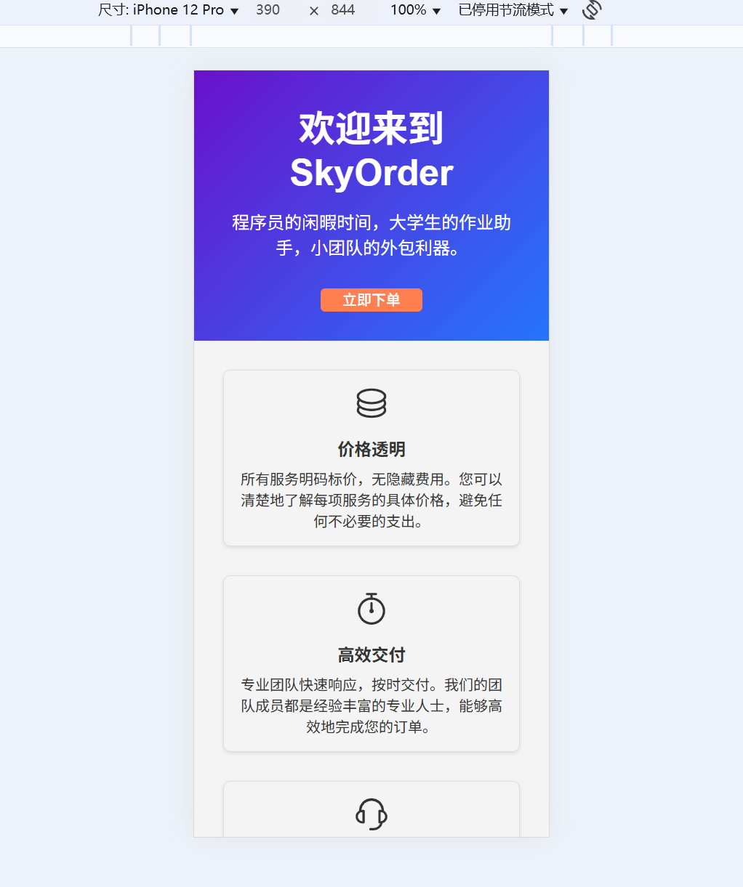
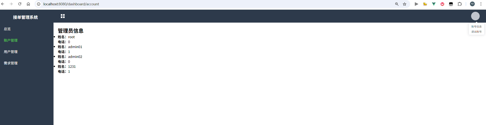

# 接单管理系统 项目说明文档





## 项目结构
```tree
E:/2025/work/new/vite/order/
├── app.exe                  # Windows 可执行文件
├── app_linux                # Linux 可执行文件
├── data.db                  # 数据库文件
├── go.mod                   # Go 模块定义文件
├── go.sum                   # Go 依赖校验文件
├── mock_data.xlsx           # 模拟数据文件
├── README.md                # 项目说明文档
├── 接单管理系统设计文档.docx  # 系统设计文档
├── cmd/                     # 主程序入口目录
│   └── main.go              # 主程序入口文件
├── config/                  # 配置文件目录
├── docs/                    # 接口文档
└── internal/                # 模块目录
```

## 使用说明

### Windows
直接双击运行 `app.exe` 即可。

### Linux
运行以下命令：
```bash
./app_linux
``` 